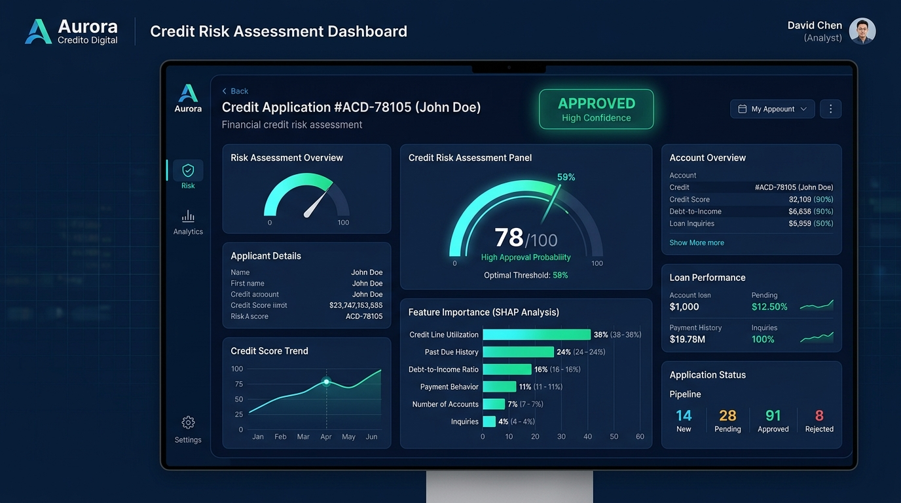

# 🏦 Aurora Crédito Digital — Previsão de Risco de Crédito e Decisão Econômica

[](https://aurora-credito-darlan.streamlit.app)
[](https://darlansandro.com.br/projeto_credito-pt)
[](https://www.python.org/)
[](LICENSE)

Aplicação de Machine Learning de ponta a ponta desenvolvida para otimização da concessão de crédito ao consumo (**Case FNAT | Aurora Crédito Digital**), equilibrando poder discriminatório probabilístico, custo financeiro assimétrico e governança regulatória.

---

## 🌐 Acessos Rápidos

* 🚀 **Simulador Interativo em Produção:** [aurora-credito-darlan.streamlit.app](https://aurora-credito-darlan.streamlit.app)
* 📘 **Estudo de Caso Completo no Portfólio:** [darlansandro.com.br/projeto_credito-pt](https://darlansandro.com.br/projeto_credito-pt)
* 📓 **Notebook de Modelagem e EDA:** [`01_entendimento_dos_dados.ipynb`](01_entendimento_dos_dados.ipynb)

---

## 📸 Interface da Aplicação e Explicabilidade SHAP

<p align="center">
  
</p>

---

## 🎯 Objetivo de Negócio e Matriz de Custo Assimétrica

O desafio de negócio consiste em mitigar a inadimplência severa (atrasos $\ge$ 90 dias em 2 anos) minimizando a função de perda econômica real da instituição:

* **Falso Negativo (Aprovar inadimplente):** Custo de **R$ 5.000,00** (perda integral do principal financiado e despesas judiciais).
* **Falso Positivo (Negar bom pagador):** Custo de **R$ 500,00** (custo de oportunidade da margem líquida de juros).
* **Relação de Assimetria:** **10 : 1** — o que torna inviável a régua de corte estatística padrão de 50%.

$$\text{Custo Total} = 5.000 \times \text{FN} + 500 \times \text{FP}$$

---

## 🚀 Benchmark dos Modelos (Holdout de Teste — 37.500 Contratos)

Submetemos a base particionada (75% treino / 25% teste) a 5 abordagens concorrentes com validação por Bootstrap ($N=500$):

| Modelo | ROC AUC (Teste) | PR AUC (Teste) | Limiar Ótimo ($\tau^*$) | Custo Total no Teste (R$) |
| :--- | :---: | :---: | :---: | :---: |
| **XGBoost (Otimizado)** 🏆 | **0,8686** | **0,4325** | **0,59** | **R$ 6.103.500,00** |
| LightGBM | 0,8679 | 0,4311 | 0,58 | R$ 6.135.000,00 |
| Random Forest (`d=7`, balanced) | 0,8587 | 0,3812 | 0,42 | R$ 6.320.000,00 |
| Árvore de Decisão (`depth=6`) | 0,8367 | 0,3450 | 0,09 | R$ 6.617.000,00 |
| Dummy Classifier (Baseline) | 0,5000 | 0,0668 | 0,07 | R$ 12.535.000,00 |

* **Economia Gerada:** O XGBoost proporcionou uma economia líquida de **R$ 513.500,00** frente à Árvore de Decisão e de mais de **R$ 6,4 milhões** frente ao baseline.
* **Impacto Operacional:** Contenção de **70,07% dos calotes potenciais** (1.756 inadimplentes evitados) assumindo apenas 13,45% de atrito comercial planejado.

---

## 🔍 Explicabilidade e Governança Regulatória (SHAP)

O pipeline incorpora explicabilidade individual com **SHAP (TreeExplainer)** para atender aos requisitos de auditoria do **BACEN (Resolução CMN nº 4.966)** e do **Código de Defesa do Consumidor (Art. 43)**:

* **Decomposição Local:** Gráfico de impacto relativo identificando os 5 fatores determinantes que empurraram a probabilidade para aprovação ou recusa.
* **Adverse Action Reasons:** Geração automática da justificativa formal em linguagem natural enviada ao proponente em caso de reprovação de crédito.

---

## 🛠️ Tecnologias e Bibliotecas

* **Linguagem:** Python 3.13
* **Machine Learning & Pipeline:** Scikit-Learn, XGBoost, LightGBM
* **Explicabilidade:** SHAP (TreeExplainer)
* **Engenharia de Dados:** Pandas, NumPy
* **Visualização:** Matplotlib, Seaborn
* **Aplicação Web:** Streamlit Cloud

---

## 💻 Como Executar o Projeto Localmente

### 1. Clonar o Repositório
```bash
git clone https://github.com/DarlanSandro/aurora-credit-risk-ml.git
cd aurora-credit-risk-ml
```

### 2. Criar e Ativar o Ambiente Virtual
```bash
# Windows:
python -m venv .venv
.venv\Scripts\activate

# Linux / macOS:
python3 -m venv .venv
source .venv/bin/activate
```

### 3. Instalar Dependências
```bash
pip install -r requirements.txt
```

### 4. Executar a Aplicação Streamlit
```bash
streamlit run app.py
```
Acesse a aplicação no navegador em `http://localhost:8501`.

---

## 📄 Licença
Distribuído sob a licença MIT. Consulte [`LICENSE`](LICENSE) para mais informações.